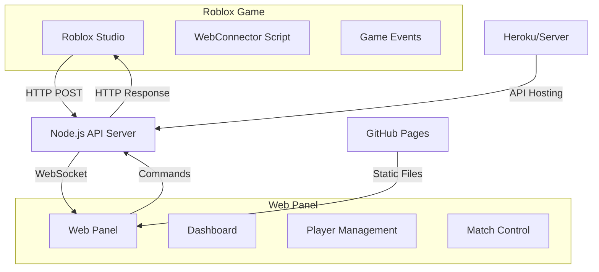

# 🔥 Forn Fire - Panel de Administración Web

<div align="center">


**Panel de administración web profesional en tiempo real para el juego Battle Royale cooperativo Forn Fire desarrollado en Roblox Studio.**

[🌐 **Ver Demo en Vivo**](https://maxviciohack.github.io/forn_fire_web/) • [📖 **Documentación**](#-documentación) • [🚀 **Instalación**](#-instalación-rápida)


</div>

---

## 🎯 **Descripción del Proyecto**

**Forn Fire** es un sistema completo de administración web que permite gestionar en tiempo real un juego Battle Royale cooperativo desarrollado en Roblox Studio. El panel ofrece una interfaz moderna con efectos visuales avanzados y comunicación bidireccional con el servidor de juego.

### ✨ **Características Principales**

- 🔥 **Diseño Post-Apocalíptico** - Interfaz temática con efectos de fuego y partículas animadas
- ⚡ **Tiempo Real** - Conexión WebSocket para actualizaciones instantáneas
- 👥 **Gestión de Jugadores** - Monitoreo y control de usuarios conectados
- 🎮 **Control de Partidas** - Administración completa de matches y cola de jugadores
- 🔫 **Sistema de Armas** - Configuración y estadísticas de armamento
- 🗺️ **Gestión de Mapas** - Control de elementos del mundo de juego
- 📊 **Dashboard Avanzado** - Estadísticas del servidor y actividad en vivo
- 📱 **Diseño Responsive** - Funciona perfectamente en cualquier dispositivo

---

## 🛠️ **Stack Tecnológico**

### **Frontend**
-  **HTML5** - Estructura del panel
-  **CSS3** - Estilos avanzados y animaciones
-  **JavaScript ES6+** - Lógica del cliente y tiempo real

### **Backend**
-  **Node.js** - Servidor de aplicaciones
-  **Express.js** - Framework web
-  **WebSocket** - Comunicación en tiempo real

### **Integración**
-  **Roblox Studio** - Motor de juego
-  **Lua** - Scripts del servidor de juego

### **Deployment**
-  **GitHub Pages** - Hosting del frontend
-  **Heroku** - Servidor backend (opcional)

---

## 🚀 **Instalación Rápida**

### **📋 Prerrequisitos**

-  **Node.js 14+**
-  **Git**
-  **Roblox Studio**

### **⚡ Instalación en 3 pasos**

```bash
# 1️⃣ Clonar el repositorio
git clone https://github.com/MaxVicioHack/forn_fire_web.git
cd forn_fire_web

# 2️⃣ Instalar dependencias
npm install

# 3️⃣ Iniciar el servidor
npm start
```

**🌐 Abrir en navegador:** http://localhost:3000

---

## 🎮 **Configuración en Roblox Studio**

### **1️⃣ Habilitar HTTP Requests**
```
Home → Settings → Security → Allow HTTP Requests ✅
```

### **2️⃣ Instalar WebConnector**
El script `WebConnector.lua` ya está incluido en el proyecto y debe colocarse en `ServerScriptService`.

### **3️⃣ Configurar URL del servidor**
```lua
-- En WebConnector.lua, línea 8
local WEB_SERVER_URL = "http://localhost:3000/api/update" -- Local
-- o
local WEB_SERVER_URL = "https://tu-servidor.herokuapp.com/api/update" -- Producción
```

---

## 📊 **Arquitectura del Sistema**



---

## 🔥 **Capturas de Pantalla**

<div align="center">

### **🏠 Dashboard Principal**


### **👥 Gestión de Jugadores**


### **🎮 Control de Partidas**


</div>

---

## 📡 **API Documentation**

### **Endpoints Principales**

#### **🔍 GET `/api/gamestate`**
Obtiene el estado completo del juego.

```json
{
  "success": true,
  "data": {
    "server": { "status": "online", "uptime": 1640995200000 },
    "players": [{ "name": "MaxVixioHack", "kills": 5, "status": "online" }],
    "stats": { "playersOnline": 1, "totalKills": 15 }
  }
}
```

#### **📤 POST `/api/update`**
Actualiza datos desde Roblox Studio.

```json
{
  "type": "players",
  "data": [
    { "name": "Player1", "kills": 3, "status": "online" }
  ]
}
```

#### **🎮 POST `/api/command`**
Envía comandos al servidor de Roblox.

```json
{
  "action": "kick_player",
  "target": "PlayerName",
  "data": null
}
```

---

## 🔧 **Configuración Avanzada**

### **🌐 Variables de Entorno**

```env
PORT=3000
WS_PORT=8080
ROBLOX_API_KEY=your_api_key_here
NODE_ENV=production
```

### **⚙️ Configuración del Juego**

```javascript
// config/game.js
module.exports = {
  maxPlayers: 100,
  matchDuration: 1200, // 20 minutos
  weaponDamage: {
    AR: 35,
    RocketLauncher: 100,
    BowWeapon: 50
  }
};
```

---

## 🎯 **Casos de Uso**

### **👨‍💼 Para Administradores**
- ✅ Monitorear jugadores en tiempo real
- ✅ Gestionar partidas activas
- ✅ Controlar configuración del servidor
- ✅ Ver estadísticas detalladas

### **👨‍💻 Para Desarrolladores**
- ✅ Debugging de mecánicas de juego
- ✅ Testing de balanceo de armas
- ✅ Análisis de rendimiento del servidor
- ✅ Monitoreo de errores

### **🎮 Para Comunidades**
- ✅ Torneos organizados
- ✅ Eventos especiales
- ✅ Moderar comportamiento tóxico
- ✅ Estadísticas públicas

---

## 🤝 **Contribución**

¡Las contribuciones son bienvenidas! Para contribuir:

1. **Fork** el proyecto
2. **Crea** una rama para tu feature (`git checkout -b feature/AmazingFeature`)
3. **Commit** tus cambios (`git commit -m 'Add some AmazingFeature'`)
4. **Push** a la rama (`git push origin feature/AmazingFeature`)
5. **Abre** un Pull Request

### **📋 Áreas de Contribución**
- 🎨 **UI/UX** - Mejoras en el diseño
- ⚡ **Performance** - Optimizaciones
- 🔧 **Features** - Nuevas funcionalidades
- 🐛 **Bug Fixes** - Corrección de errores
- 📖 **Documentation** - Mejoras en docs

---

## 📈 **Roadmap**

### **🔄 Versión Actual (2.0.0)**
- ✅ Panel web completo
- ✅ Comunicación tiempo real
- ✅ Gestión de jugadores
- ✅ Control de partidas

### **🚀 Próximas Versiones**

#### **v2.1.0 - Mejoras de UI**
- 🎨 Temas personalizables
- 📱 App móvil nativa
- 🔔 Notificaciones push
- 📊 Gráficos avanzados

#### **v2.2.0 - Analytics**
- 📈 Dashboard de analytics
- 🎯 Métricas de jugadores
- 📊 Reportes automáticos
- 🔍 Sistema de logs

#### **v3.0.0 - Escalabilidad**
- 🏗️ Arquitectura de microservicios
- 🗄️ Base de datos distribuida
- ☁️ Deploy en la nube
- 🔐 Autenticación avanzada

---

## 🐛 **Resolución de Problemas**

### **❌ Error: "HTTP Requests not enabled"**
**Solución:**
```
1. Abrir Roblox Studio
2. Home → Settings → Security
3. Activar "Allow HTTP Requests"
4. Reiniciar Roblox Studio
```

### **❌ Error: "Connection refused"**
**Solución:**
```bash
# Verificar que el servidor esté ejecutándose
npm start

# Verificar puerto disponible
netstat -an | grep 3000
```

### **❌ Error: "WebSocket connection failed"**
**Solución:**
```javascript
// Verificar configuración en realtime.js
this.wsUrl = 'ws://localhost:8080'; // Local
// o
this.wsUrl = 'wss://tu-servidor.com'; // Producción
```

---

## 📄 **Licencia**

Este proyecto está bajo la Licencia MIT. Ver el archivo [LICENSE](LICENSE) para más detalles.

```
MIT License

Copyright (c) 2025 MaxVixioHack

Permission is hereby granted, free of charge, to any person obtaining a copy
of this software and associated documentation files (the "Software"), to deal
in the Software without restriction, including without limitation the rights
to use, copy, modify, merge, publish, distribute, sublicense, and/or sell
copies of the Software.
```

---

## 👨‍💻 **Autor**

<div align="center">

**MaxVixioHack**

[](https://github.com/MaxVicioHack)
[](https://www.roblox.com/users/6163489980/profile)

*Desarrollador de juegos apasionado por crear experiencias únicas en Roblox*

**Con la asistencia de ChuyMine (Claude AI)**

</div>

---

## 🙏 **Agradecimientos**

- 🎮 **Roblox Corporation** - Por la plataforma de desarrollo
- 🌐 **GitHub** - Por el hosting gratuito
- 💻 **Node.js Community** - Por las herramientas increíbles
- 🎨 **CSS Grid & Flexbox** - Por hacer posible el diseño responsive
- 🔥 **Toda la comunidad** - Por el feedback y sugerencias

---

## 📊 **Estadísticas del Proyecto**


---

<div align="center">

**🔥 ¡Hecho con ❤️ para la comunidad de Roblox! 🔥**

*Si este proyecto te ayudó, ¡no olvides darle una ⭐!*

</div>
